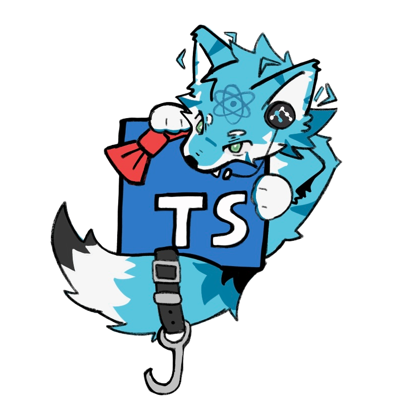

# furry-ts-errors

VSCode Extension Based on [yoavbls/pretty-ts-errors](https://github.com/yoavbls/pretty-ts-errors "yoavbls/pretty-ts-errors")

See details: [react-furry-error](https://masaominn.github.io/react-furry-error "react-furry-error")

See details in Feishu(faster): [Feishu Document](https://kcnhl2uub4k0.feishu.cn/wiki/WkOUwdykxiXjx8kLNH3chhpQn0c)

Install Extension:Search for `Furry ts Errors` in extension marcket ,or [Furry TypeScript Errors - Visual Studio Marketplace](https://marketplace.visualstudio.com/items?itemName=tangetsu.furry-ts-errors)
